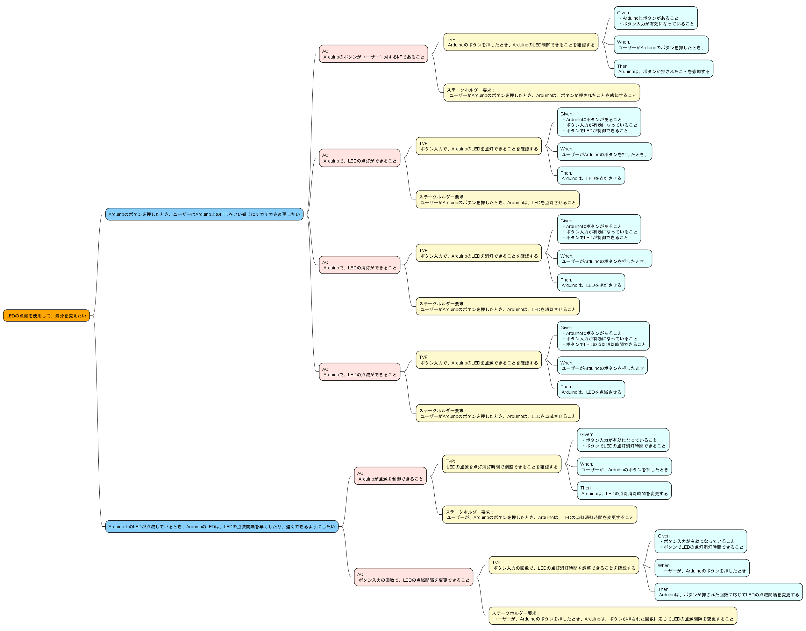

## 自然言語要求を（静的に）テストする！

製造業の片隅で、ソフトウェアエンジニア、テストエンジニア（現QAエンジニア）を経験したことをメモ程度に書き残します。
自然言語要求をテストする方法を考えて、まとめていきます。
まずは、要求構文とUSDMを使用して記述した要求文書に対して、textlintを用いて文法的、構造的なチェック（静的テスト）について考えていきます。

#### 目次
[題材となる要求](#題材となる要求)
[USDMと要求構文表記](#USDMと要求構文表記)
[textliintの設定](#textliintの設定)
[自然言語要求を静的テスト](#自然言語要求を静的テスト)
[要求は分かりやすくなる？？](#要求は分かりやすくなる？？)

#### 題材となる要求

最終的にはモノが動くのが見たいので、ArduinoでLチカを題材に粗い要求を考えたいと思います。
（組み込みソフトウェアエンジニアだけど、Arduino触ったことがない・・・）

〇Arduinoでやってみたいこと

・ボタンを押して、Lチカの間隔をいい感じにしたい
・早い点滅、遅い点滅ができるようにする

〇ユーザーのやりたいことを補足する
ユーザーにニーズを設定しました（≒私がやりたいこと）。やりたいことを少し、整理していきます。
まず、ユーザーニーズに、主語や修飾語などを追加していきます。
5W1Hをベースに、不足しているものを考えます。

【原文】
**ボタンを押して、Lチカの間隔をいい感じにしたい**

When（いつ）：Arduinoのボタンを押したとき
Where（どこで）：Arduino上で
Who（誰が）：ユーザー（私）
What（何を）：Arduino上にあるLEDを
Why（なぜ）：気分に合わせて、LEDのちかちかを変更したいから
How（どのように）：いい感じにちかちかを変更させる（ちかちかの手段は後で決める）

**【改善後】 Arduinoのボタンを押したとき、ユーザーはArduino上のLEDをいい感じにチカチカを変更したい。なぜなら、ユーザーは気分に合わせて、LEDのちかちかを変更したいから**

【原文】
**早い点滅、遅い点滅ができるようにする**

When（いつ）：ArduinoのLEDが点滅しているとき
Where（どこで）：Arduino上で
Who（誰が）：ArduinoのLED
What（何を）：Arduino上にあるLEDの点滅の間隔を
Why（なぜ）：気持ちを上げるとき、落ち着かせたいときに合わせて変更したいから
How（どのように）：早くしたり、遅くしたりする

**【改善後】 Arduino上のLEDが点滅しているとき、ArduinoのLEDは、LEDの点滅間隔を早くしたり、遅くできるようにしたい。なぜなら、ユーザーは気持ちを上げたり、落ち着かせるのに使いたいから**

Whyを考えると、ユーザーが本当にしたいことは、
**「LEDの点滅を使用して、気分を変えたい」**
であることがわかりました。

これで、潜在（根源）的な要求（要望）を獲得することができました！

〇ユーザーのやりたいことの達成基準を考える

ユーザーのやりたいことを詳しい内容を獲得することができました。しかし、まだまだ実際の機械を動かすようにするためには不十分です。
ここでは、ユーザーのやりたいことに対して、こんなことが達成できれば、ユーザーのやりたいこと（行動、振る舞い）を満たせるかを考えていきます。

マインドマップを使用して、詳細化していきます。
マインドマップを書いていく上で、文章のグロッサリーを作っていきます。
要求マインドマップを作成する際は、BDD（振る舞い駆動開発）のGherkinガイドワードを使用していきます。
ユーザーのやりたいことに対して、達成基準（Achievement Criteria、AC）を考えていきます。この達成基準は、こんなことが達成できれば、ユーザーのやりたいことを実現できるか、満たせるかを考えていきます。

達成基準に対して、テストで気になる点を考えていきます。
テストで気になる点（Test View Point、TVP）は、作ったものが達成基準に合致しているか検査、検証するためにはどんなことがテストとして必要かを考えます。
達成基準に対になる存在が、このTVPになります。

要求作成用グロッサリー

| No  | Grossary words|Contents                                      |
| --- | -------------- |-------------------------------------------- |
| 1   | Arduino        | 今回の要求を実現するために使用するマイコンボード|
| 2   | ユーザー | Arduinoを使ってLチカを実現したい人 |
| 3   | LED     | Arduinoに搭載されているLEDのこと |
| 4   | ボタンを押す | Arduinoのボード上にあるボタンを押すこと |
| 5   | 点灯する | Arduinoのボード上にあるLEDを点灯する |
| 6   | 消灯する | Arduinoのボード上にあるLEDを消灯する |
| 7   | 点滅する | Arduinoのボード上にあるLEDを点滅させる |

獲得したステークホルダー要求を書き出してみる。
| Req_ID | Reqirements |
|---|---|
| LCReq-01 | ユーザーがArduinoのボタンを押したとき、Arduinoは、ボタンが押されたことを感知すること |
| LCReq-02 | ユーザーがArduinoのボタンを押したとき、Arduinoは、LEDを点灯させること |
| LCReq-03 | ユーザーがArduinoのボタンを押したとき、Arduinoは、LEDを消灯させること |
| LCReq-04 | ユーザーがArduinoのボタンを押したとき、Arduinoは、LEDを点滅させること |
| LCReq-05 | ユーザーが、Arduinoのボタンを押したとき、Arduinoは、LEDの点灯消灯時間を変更すること |
| LCReq-06 | ユーザーが、Arduinoのボタンを押したとき、Arduinoは、ボタンが押された回数に応じてLEDの点滅間隔を変更すること |

〇実機の代わりにTinkercadを使う
Arduinoの実機を持っていないので、[Tinkercad](https://www.tinkercad.com/)と呼ばれるArduinoの回路シミュレータを使いたいと思います。

#### USDMと要求構文表記

〇要求構文について
今回は、ISO/IEC/IEEE 29148:2011内「5.2.4 Requirements construct」を使用して要求文化していきます。

参考：[山修の開発文書品質入門（4） ―― 要求テンプレートを利用する](https://asdoq.jp/blog/details.php?bid=9)

山本修一郎先生の[山修の開発文書品質入門（4） ―― 要求テンプレートを利用する](https://asdoq.jp/blog/details.php?bid=9)より、要求構文について引用します。

>ISO/IEC/IEEE 29148:2011内「5.2.4 Requirements construct」では，下記のように３種類の要求構文の型を例示しています．この要求構文も要求テンプレートの例です．なお，日本語構文に合わせるために，助詞を補うとともに，語順を入れ替えています． 
(構文の型１)　**[条件]** **[主体]** が **[対象]** を **[制約]** **[活動]** する必要がある． 
(構文の型２)　**[条件]** **[活動 または 制約]** は **[値]** である必要がある． 
(構文の型３)　**[主体]** が **[値条件]** で **[活動]** する必要がある． 

〇要求構文に変換する

抽出したステークホルダー要求は、まだ要求構文を適用していないので、要求構文を適用していきます。

LCReq-01
ユーザーがArduinoのボタンを押したとき、Arduinoは、ボタンが押されたことを感知すること

構文：構文の型１

条件：ユーザーがArduino上にあるボタンを押したとき
主体：Arduinoは
対象：Arduinoのボード上のボタンを押される
制約：なし
活動：検知する
必要がある

**ユーザーがArduino上にあるボタンを押したとき、ArduinoはArduinoのボード上のボタンを押されたことを検知する必要がある**

LCReq-02
ユーザーがArduinoのボタンを押したとき、Arduinoは、LEDを点灯させること

構文：構文の型１

条件：ユーザーがArduino上にあるボタンを押したとき
主体：Arduinoは
対象：Arduinoのボード上のLED
制約：１秒以内に
活動：点灯する
必要がある

**ユーザーがArduino上にあるボタンを押したとき、ArduinoはArduinoのボード上のLEDを、１秒以内に点灯する必要がある**

LCReq-03
ユーザーがArduinoのボタンを押したとき、Arduinoは、LEDを消灯させること

構文：構文の型１

条件：ユーザーがArduino上にあるボタンを押したとき
主体：Arduinoは
対象：Arduinoのボード上のLED
制約：１秒以内に
活動：消灯する
必要がある

**ユーザーがArduino上にあるボタンを押したとき、ArduinoはArduinoのボード上のLEDを、１秒以内に消灯する必要がある**

LCReq-04
ユーザーがArduinoのボタンを押したとき、Arduinoは、LEDを点滅させること

構文：構文の型１

条件：ユーザーがArduino上にあるボタンを押したとき
主体：Arduinoは
対象：Arduinoのボード上のLED
制約：１秒以内に
活動：点滅する
必要がある

**ユーザーがArduino上にあるボタンを押したとき、ArduinoはArduinoのボード上のLEDを、１秒以内に点滅する必要がある**

LCReq-05
ユーザーが、Arduinoのボタンを押したとき、Arduinoは、LEDの点灯消灯時間を変更すること

構文：構文の型１

条件：ユーザーがArduino上にあるボタンを押したとき
主体：Arduinoは
対象：Arduinoのボード上のLEDの点灯消灯時間を
制約：１秒以内に
活動：変更する
必要がある

**ユーザーがArduino上にあるボタンを押したとき、Arduinoのボード上のLEDの点灯消灯時間を、１秒以内に点滅する必要がある**

LCReq-06
ユーザーが、Arduinoのボタンを押したとき、Arduinoは、ボタンが押された回数に応じてLEDの点滅間隔を変更すること

構文：構文の型１

条件：ユーザーがArduino上にあるボタンを押したとき
主体：Arduinoは
対象：ボタンが押された回数に応じてLEDの点滅間隔を
制約：１秒以内に
活動：変更する
必要がある

**ユーザーがArduino上にあるボタンを押したとき、Arduinoはボタンが押された回数に応じてLEDの点滅間隔を、１秒以内に点滅する必要がある**

ここから、USDMを用いて、要求を構造化し、実際に動かすための仕様を考えていきたいと思います。

〇USDMで要求を構造化し仕様を考える

<table>
<tr>
  <th colspan=4>Lチカの要求仕様</th>
</tr>
<tr bgcolor="#fffff0">
  <td>要求</td>
  <td>LCReq-01</td>
  <td colspan=2>ユーザーがArduino上にあるボタンを押したとき、ArduinoはArduinoのボード上のボタンを押されたことを検知する必要がある</td>
</tr>
<tr bgcolor="#fffff0">
  <td></td>
  <td>理由</td>
  <td colspan=2></td>
</tr>
<tr bgcolor="#fffff0">
  <td></td>
  <td>説明</td>
  <td colspan=2></td>
</tr>
<tr bgcolor="#e0ffff">
  <td></td>
  <td colspan=3>＜＞</td>
</tr>
<tr bgcolor="#e0ffff">
  <td></td>
  <td>要求</td>
  <td>RegFlog-01-01</td>
  <td></td>
</tr>
<tr bgcolor="#e0ffff">
  <td></td>
  <td></td>
  <td>理由</td>
  <td></td>
</tr>
<tr bgcolor="#e0ffff">
  <td></td>
  <td></td>
  <td>説明</td>
  <td></td>
</tr>
<tr bgcolor="#e0ffff">
  <td></td>
  <td>要求</td>
  <td>RegFlog-01-02</td>
  <td></td>
</tr>
<tr bgcolor="#e0ffff">
  <td></td>
  <td></td>
  <td>理由</td>
  <td></td>
</tr>
<tr bgcolor="#e0ffff">
  <td></td>
  <td></td>
  <td>説明</td>
  <td></td>
</tr>
<tr bgcolor="#fffff0">
  <td>要求</td>
  <td>RegFlog-02</td>
  <td colspan=2></td>
</tr>
<tr bgcolor="#fffff0">
  <td></td>
  <td >理由</td>
  <td colspan=2></td>
</tr>
<tr bgcolor="#fffff0">
  <td></td>
  <td>説明</td>
  <td colspan=2>上位要求の説明</td>
</tr>
<tr bgcolor="#e0ffff">
  <td></td>
  <td colspan=3>＜＞</td>
</tr>
<tr bgcolor="#e0ffff">
  <td></td>
  <td>要求</td>
  <td>RegFlog-02-01</td>
  <td></td>
</tr>
<tr bgcolor="#e0ffff">
  <td></td>
  <td></td>
  <td>理由</td>
  <td></td>
</tr>
<tr bgcolor="#e0ffff">
  <td></td>
  <td></td>
  <td>説明</td>
  <td>下位要求の説明</td>
</tr>

<tr>
  <td></td>
  <td></td>
  <td>SpecFlog-02-01-01</td>
  <td></td>
</tr>
<tr>
  <td></td>
  <td></td>
  <td>SpecFlog-02-01-02</td>
  <td></td>
</tr>
<tr>
  <td></td>
  <td></td>
  <td>SpecFlog-02-01-03</td>
  <td></td>
</tr>
<tr>
  <td></td>
  <td></td>
  <td>SpecFlog-02-01-04</td>
  <td></td>
</tr>
<tr>
  <td></td>
  <td></td>
  <td>SpecFlog-02-01-02</td>
  <td></td>
</tr>
<tr bgcolor="#e0ffff">
  <td></td>
  <td colspan=3>＜カエルの口＞</td>
</tr>
<tr bgcolor="#e0ffff">
  <td></td>
  <td>要求</td>
  <td>RegFlog-02-02</td>
  <td></td>
</tr>
<tr bgcolor="#e0ffff">
  <td></td>
  <td></td>
  <td>理由</td>
  <td></td>
</tr>
<tr bgcolor="#e0ffff">
  <td></td>
  <td></td>
  <td>説明</td>
  <td>下位要求の説明</td>
</tr>
<tr>
  <td></td>
  <td></td>
  <td>SpecFlog-02-02-01</td>
  <td></td>
</tr>
<tr>
  <td></td>
  <td></td>
  <td>SpecFlog-02-02-02</td>
  <td></td>
</tr>
<tr>
  <td></td>
  <td></td>
  <td>SpecFlog-02-02-03</td>
  <td></td>
</tr>
<tr>
  <td></td>
  <td></td>
  <td>SpecFlog-02-02-04</td>
  <td></td>
</tr>
<tr bgcolor="#fffff0">
  <td>要求</td>
  <td>RegFlog-03</td>
  <td colspan=2></td>
</tr>
<tr bgcolor="#fffff0">
  <td></td>
  <td>理由</td>
  <td colspan=2></td>
</tr>
<tr bgcolor="#fffff0">
  <td></td>
  <td>説明</td>
  <td colspan=2>上位要求の説明</td>
</tr>
<tr bgcolor="#e0ffff">
  <td></td>
  <td colspan=3>＜＞</td>
</tr>
<tr bgcolor="#e0ffff">
  <td></td>
  <td>要求</td>
  <td>RegFlog-03-01</td>
  <td></td>
</tr>
<tr bgcolor="#e0ffff">
  <td></td>
  <td></td>
  <td>理由</td>
  <td></td>
</tr>
<tr bgcolor="#e0ffff">
  <td></td>
  <td></td>
  <td>説明</td>
  <td>下位要求の説明</td>
</table>
 

#### textliintの設定

#### 自然言語要求を静的テスト

#### 要求は分かりやすくなる？？
