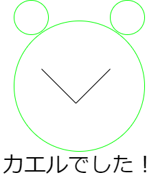
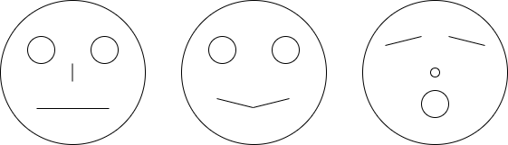
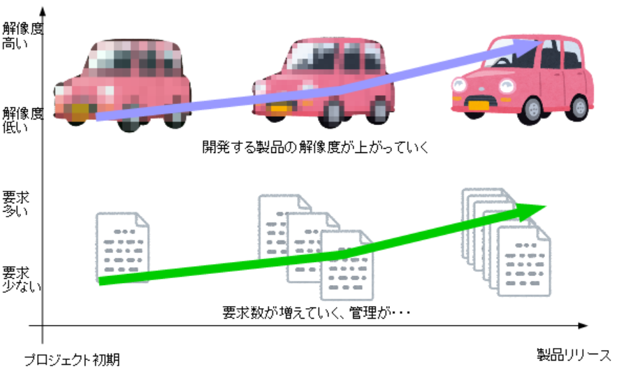
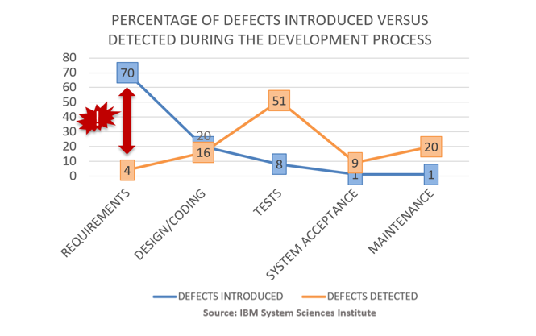
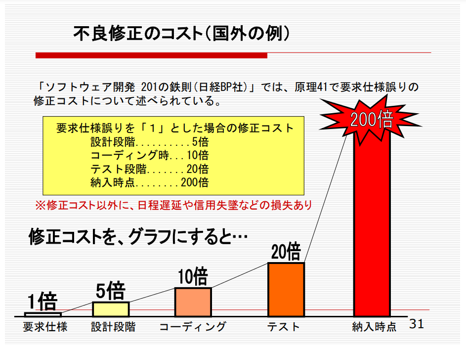
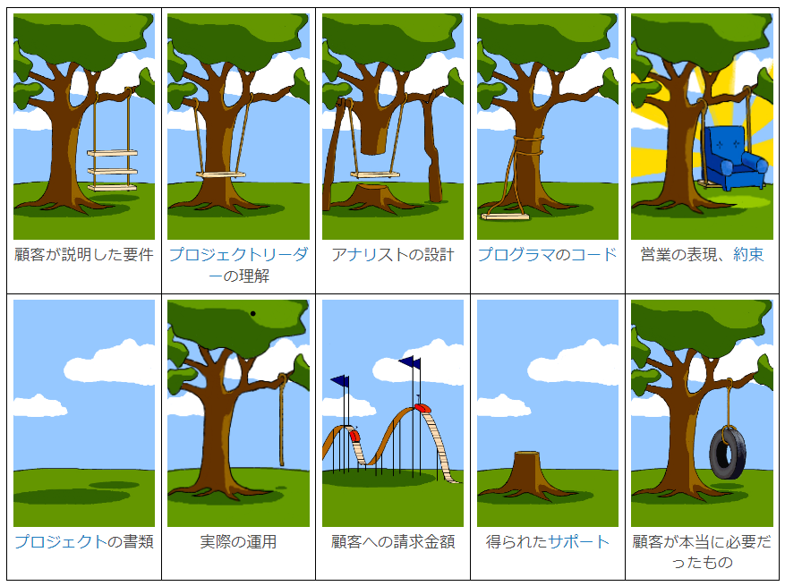

## よい要求のために知っておきたい5つのこと

製造業の片隅で、ソフトウェアエンジニア、テストエンジニア（現QAエンジニア）を経験したことをメモ程度に書き残します。
要求開発する上で知っておきたいことは、５個以上ありますが、私の経験上最も役に立った５つの知っておきたいことを厳選しました。
要求の大切さを再認識してもらえたらうれしいです。

#### 目次
[要求とは？](#要求とは？)
[よい要求、わるい要求](#よい要求、わるい要求)
[要求ってとても大事！](#要求ってとても大事！)
[よい要求を書くために必要なこと](#よい要求を書くために必要なこと)
[要求のライフサイクルを考える](#要求のライフサイクルを考える)

#### 要求とは？

エンジニアリングの世界には、「**要求**」が存在します。
特に、製造業の製品づくりにおいては、要求が出発点になることが多いです。
メカ、エレ、ソフトのどのエンジニアリングにおいても、要求はとても重要です！

そもそも要求って、どんな意味なのか再確認してみましょう。

goo辞書より要求の意味を引用する。
>よう‐きゅう〔エウキウ〕【要求】 の解説
>［名］(スル)
>１ 必要または当然なこととして相手に強く求めること。「待遇改善を—する」「—を飲む」
>２ 必要とすること。「からだが水分を—している」「時代の—」
>３ ⇒欲求2

（https://dictionary.goo.ne.jp/word/%E8%A6%81%E6%B1%82/ より引用）

また、英語の「require」の成り立ちを見てみましょう。
[Etymonline](https://www.etymonline.com/)より「require」の成り立ちを引用する。
>14世紀後半に由来するこの動詞 requeren は、「（誰かに）質問をする、尋ねる」という意味でしたが、この使い方は今では古くなっています。
>この単語は、フランス語の requerre, requerir（「探す、取り寄せる；乞う、質問する、要求する；要求する」という意味）から来ており、それはさらに、ラテン語の *requaerere、requirere（「知りたがる、質問する、（必要なものを）要求する」という意味）から派生しています。
>ラテン語の re-（「何度も」という意味を持つ可能性がある - re- を見てください）と quaerere（「質問する、探す」という意味 - query（動詞）を見てください）が組み合わさっています。
>後のいくつかの英語の意味では、恐らく直接ラテン語から来ています。

(https://www.etymonline.com/jp/word/require より引用)

製造業で良くみるモノづくりの流れは、こんな感じだと思います。

私も過去、ソフトウェアを設計する、またはテストを設計するときに、こう作ってほしい（こうテストしてほしい）と求められてモノを作ってきました。
（プロトタイプ開発の場合、要求をプロトタイピングしながら作り上げることがあると思います。）

#### よい要求、わるい要求

私のいる製造業（自動車関連）で、**よい**とされている要求と**わるい**とされている要求の例をみてみましょう。

要求する人が、こんな絵を描いてほしいと文章で書いた要求を見比べてみてください。
この２つの要求を書いた人物は、**同一人物**で**同じものを描いてほしい**と考えています。

**・要求①**
>【要求】
>・配布された紙とペン（緑・黒）を使って、記号〇と―を使うこと
>・〇を三つ、ーを二つ使って顔を書くこと
>・大きさは自由に変えて良いこと
>・5分で書ききること 
【使う図形】
〇、〇、〇、ー、ー

**・要求②**
>【要求】
>・配布した紙とペンを使うこと
>・記号”〇”と”ー”を使って、絵を描くこと
>・紙に2色のペンを使って、下記の要求に従ってカエルの顔を書くこと
>・カエルの顔の輪郭は、緑のペンを使い大きい”〇”で書くこと
>・カエルの目は、緑のペンで”〇”を2つ、顔の輪郭よりも小さく書くこと
>・目は顔の輪郭の外側、かつ12時を基準点とし、1時と11時の位置になるように書くこと
>・口は、黒いペンで書くこと
>・口は、”―”を2つ使い表現すること
>・口は、アルファベットのVの字の様に、顔の中心に書くこと
>・5分で書ききること 
【使う図形】
〇、〇、〇、ー、ー

**実際に欲しかったもの**
この２つの要求を書いた（考えた）人は、このような絵を描いて欲しいと考えていました。

要求①の要求文だと、いろんな顔が書かれてしまいますね。。。
要求①だと、このように一意に定まらない顔が描けてしまいます。

要求①で描かれた絵

私も現場で、要求①のようなあいまいさを残した要求を見たことがないです。
ただし、お客様からいただく要求にはあいまいさがあります、少なからず。それらの類推が甘く、お叱りを受けたことが何度もあります。苦い思い出です。。。
（だってそんな要求書いてなくないですか？？？？といつも心の中では思っています！！）

 

**なんで悪い要求が生まれるの？**
ただし、わるい要求が悪さをしてしまうには、理由があります。
開発において、作る製品の要求を固めることができない（粗い要求の状態）ことがよくあります。
試作など、製品の開発を繰り返しながら、製品と要求が同時に成長していきます（下図参照）。
わるい要求は、粗い要求を開発活動の反復に沿って、出てきた要求のカイゼンを管理しないことに起因することがあります。
（私の経験談なので、これ以外にもありますし管理できていても悪くなることがあると思います。）

粗い要求のライフサイクルを管理せずに、どんどん要求を追加していき開発の解像度を上げていくことがあります。
適切な要求管理が行われないことで、要求が劣化し、製品開発に悪い影響を与えます。
**粗い**要求を管理しないことにより、いつの間にか**わるい**要求へと変化してしまいます。

要求の管理って難しいですよね・・・
私も、よくメールで要求の追加の連絡があったり、打ち合わせのときにホワイトボードに書かれたものが要求となることがありました。
苦い思い出です・・・

#### 要求ってとても大事！

なぜ、要求のライフサイクルを管理する必要があるのかを説明します。
端的に言うと、
「**不具合を最も混入させやすいが、逆に不具合を除去するコストが最も安価である**」
からです。

・**不具合混入は要求開発段階が最も多い！**
不具合混入と検知率について
[Yves Genevaux](https://fr.linkedin.com/in/yves-genevaux?trk=article-ssr-frontend-pulse_publisher-author-card)さんのLinkedInの記事[Requirements in the Loop: The Future of Model-Based Systems Engineering](https://www.linkedin.com/pulse/requirements-loop-future-model-based-system-yves-g%C3%A9nevaux)を参考にしています。

（[Requirements in the Loop: The Future of Model-Based Systems Engineering](https://www.linkedin.com/pulse/requirements-loop-future-model-based-system-yves-g%C3%A9nevaux)より引用）

画像の通り、一番左にある要求開発工程において不具合の混入率が70％となっています。逆に、不具合の検知率が4%と検知することが最も困難である工程とも言えます。たぶん、皆様もこう考えると思います。
**「要求開発工程において、不具合を見つける手段は、レビューしかないのではないか？」**
（要求に形式手法を用いたら、テストできるかも？？と思った方がいるかもしれません）
一般的には、文章で書かれた要求をテストをする。特に、動的テストをするというイメージは浮かばないと思います。
この要求開発工程で、作り込まれる不具合を同一行程で、検知し修正することができれば、より効果のあるシフトレフトが実現できるものと考えられます。

（補足）
今回、このデータを引用させていただ記事には、**R**equirement **i**n the **L**oop **S**imulation (RILS)という記載があります。
これは、要求を動的にテストすることが可能ということを示しています。
詳しくは、[Dassult Systems社](https://www.3ds.com/ja/products-services/catia/products/stimulus/)のサイトをご覧ください。

・**不具合除去コストが最も安い！**
不具合除去コストについて
奈良隆正さんの資料（JASPIC SPIJapan2009 [ソフトウェア品質保証の方法論、技法、その変遷～先達の知恵に学ぶ～](https://www.jaspic.org/event/2009/SPIJapan/keynote/SJ9keynote.pdf)）を参考にしています。

（NARAコンサルティング奈良隆正さんの[ソフトウェア品質保証の方法論、技法、その変遷～先達の知恵に学ぶ～](https://www.jaspic.org/event/2009/SPIJapan/keynote/SJ9keynote.pdf)P31より引用）

要求開発工程において、作られた不具合を取り除くために発生するコストについて考えます。同じ要求開発工程に比べ、コーディングやテストで修正しようとすると、上図のように**とてもコストが高く**なります。
**要求開発工程では、不具合（誤った要求）が作り込まれやすく、検知するのが難しいが、要求開発工程で修正することができれば最も安く直すことができます。**
不具合が後工程へ流出することがなければ、不具合によって発生する**手戻り（価値を生まない作業）を未然に防ぐこと**ができます。
要求開発で、不具合を見つけて修正できれば、みんながハッピーになれそうです。

そのカギは、要求開発工程におけるテスト（静的テスト、動的テストの両方）です。
要求開発工程の不具合検知率を上げることで、間違いの少ない要求を作ることが可能になるはずです。

#### よい要求を書くために必要なこと

要求にも作法や、伝えるために必要な情報群があります。

・要求工学
山本修一郎先生（現名古屋専門職大学？）、故青山幹雄先生が日本では有名です。
お二方が発信されている本、サイトはとても学びが深いです。

山本　修一郎先生
[システム開発文書品質研究会](https://asdoq.jp/blog/)
[連載　要求工学](https://www.bcm.co.jp/site/youkyu/index.html)
[要求開発の基礎知識](https://www.kindaikagaku.co.jp/book_list/detail/9784764960015/)

青山　幹雄先生
[REBOKに基づく要求分析実践ガイド](https://www.kindaikagaku.co.jp/book_list/detail/9784764904927/)

**◇言葉で伝えることは難しい**
日本語は、読み手や聞き手に類推させるハイコンテクストな言語です。書く側、話す側が相手に伝わるだろうで文章を作成すると、読み手、利き手が行間を**類推すること**になります。日本語は、相手の類推を強く求める言語（≒話者が多い）です。（その代わり、言葉にいろいろな意味や雰囲気を持たせることができるので、美しい言語でもあります。）
この類推こそが、要求のすれ違いを生みます。

参考
[日本語はハイコンテクストで外国人に分かりづらい？ビジネスで使えるコミュニケーション術4つ](https://asiatojapan.com/jgs/recruitment-how-to/high-context/)

有名な顧客が本当に必要だったもの（木とブランコ）の絵は、いろいろな人たちの間で、類推が発生した結果起きたと、私は考えています。

（[顧客が本当に必要だったもの](https://dic.nicovideo.jp/a/%E9%A1%A7%E5%AE%A2%E3%81%8C%E6%9C%AC%E5%BD%93%E3%81%AB%E5%BF%85%E8%A6%81%E3%81%A0%E3%81%A3%E3%81%9F%E3%82%82%E3%81%AE) より引用）

**背景情報**や**理由**を記載し、**明確**にかつ**一意**に伝えることが要求開発においてとても重要です。

**◇要求を書くための構文がある**
EARSについての説明

山本修一郎先生の[Business Communication 81:要求テンプレート](https://www.bcm.co.jp/site/youkyu/youkyu81.html)より、EARSにつて引用します。

>EARSとは、ロールスロイス社のMarvinらが提案している安全要求を自然言語で記述するためのEARS（Easy Approach to Requirements Syntax）のことです。

EARSには５つの構文があります。
詳しくは、引用元のページをご参照ください。

1)Ubiquitous requirements（偏在型）
2)Event-driven requirements（契機型）
3)Unwanted behaviors（不測型）
4)State-driven requirements（状態型）
5)Optional features

**◇要求を構造化する**
要求を平文で書くとのっぺりとして、読みにくく要求同士の関係性や、背景情報（理由や目的）を取得しにくいです（個人の感想ですが。。。）
システムクリエイツの故清水吉男さんが考案されたUSDMを使用すると、要求の階層（空間）感を得ることができます。
認知特性としても、平文よりも構造を持った文章になるので、読みやすさ・理解のしやすさが上がると思われます（そのように感じています）。

こちらも詳しいことは、下記サイトや書籍を参考にしてください。

[【チュートリアル】そうだったのか！ＵＳＤＭ](https://affordd.jp/wp-content/uploads/conference2015/affordd_conference2015_tutorial.pdf)

**◇要求のための辞書**

要求②へ、EARSとUSDMを適用してみたいと思います。
要求②は、基本的に偏在型で書ききることができると思います。
こちらが適用した例です。
（いつもExcel使っているので、Markdownにhtmlで表を表現してUSDM書くの新鮮でした。面白い！）

<table>
<tr>
  <th colspan=4>カエルの絵を描くための要仕様</th>
</tr>
<tr bgcolor="#fffff0">
  <td>要求</td>
  <td>RegFlog-01</td>
  <td colspan=2>絵を描く人は提供した紙とペンを使用する必要がある</td>
</tr>
<tr bgcolor="#fffff0">
  <td></td>
  <td>理由</td>
  <td colspan=2>決まった用紙とペンを使用して欲しいから</td>
</tr>
<tr bgcolor="#fffff0">
  <td></td>
  <td>説明</td>
  <td colspan=2>自習用の教材</td>
</tr>
<tr bgcolor="#e0ffff">
  <td></td>
  <td colspan=3>＜カエルの顔を描くための道具＞</td>
</tr>
<tr bgcolor="#e0ffff">
  <td></td>
  <td>要求</td>
  <td>RegFlog-01-01</td>
  <td>絵を描く人は、提供されたA4用紙を使用する必要がある</td>
</tr>
<tr bgcolor="#e0ffff">
  <td></td>
  <td></td>
  <td>理由</td>
  <td>データに取り込むため同じ 用紙サイズで統一する必要があるから</td>
</tr>
<tr bgcolor="#e0ffff">
  <td></td>
  <td></td>
  <td>説明</td>
  <td>指定用紙以外に描かれるとデータ収集した際に、ファイリングがきれいにできない</td>
</tr>
<tr bgcolor="#e0ffff">
  <td></td>
  <td>要求</td>
  <td>RegFlog-01-02</td>
  <td>絵を描く人は、提供されたペン（緑と黒）を使用する必要がある</td>
</tr>
<tr bgcolor="#e0ffff">
  <td></td>
  <td></td>
  <td>理由</td>
  <td>決められた色を使用して、絵を描いてほしいから</td>
</tr>
<tr bgcolor="#e0ffff">
  <td></td>
  <td></td>
  <td>説明</td>
  <td>指定色で絵を描く</td>
</tr>
<tr bgcolor="#fffff0">
  <td>要求</td>
  <td>RegFlog-02</td>
  <td colspan=2>絵を描く人は、カエルの顔を書く必要がある</td>
</tr>
<tr bgcolor="#fffff0">
  <td></td>
  <td >理由</td>
  <td colspan=2>絵を描いてほしい人は、カエルの絵を描いてほしいと思っているから</td>
</tr>
<tr bgcolor="#fffff0">
  <td></td>
  <td>説明</td>
  <td colspan=2>上位要求の説明</td>
</tr>
<tr bgcolor="#e0ffff">
  <td></td>
  <td colspan=3>＜カエルの顔の輪郭＞</td>
</tr>
<tr bgcolor="#e0ffff">
  <td></td>
  <td>要求</td>
  <td>RegFlog-02-01</td>
  <td>絵を描く人は、カエルの輪郭を描く必要がある</td>
</tr>
<tr bgcolor="#e0ffff">
  <td></td>
  <td></td>
  <td>理由</td>
  <td>顔には輪郭が必要だから</td>
</tr>
<tr bgcolor="#e0ffff">
  <td></td>
  <td></td>
  <td>説明</td>
  <td>下位要求の説明</td>
</tr>

<tr>
  <td></td>
  <td></td>
  <td>SpecFlog-02-01-01</td>
  <td>カエルの顔の輪郭と目を書く場合、緑色のペンを使う</td>
</tr>
<tr>
  <td></td>
  <td></td>
  <td>SpecFlog-02-01-02</td>
  <td>カエルの顔の輪郭は、大きい”〇”で書く</td>
</tr>
<tr>
  <td></td>
  <td></td>
  <td>SpecFlog-02-01-03</td>
  <td>カエルの目は、”〇”を2つ、顔の輪郭よりも小さく書く</td>
</tr>
<tr>
  <td></td>
  <td></td>
  <td>SpecFlog-02-01-04</td>
  <td>カエルの目は、”〇”を2つ、顔の輪郭よりも小さく書く</td>
</tr>
<tr>
  <td></td>
  <td></td>
  <td>SpecFlog-02-01-02</td>
  <td>カエルの目は顔の輪郭の外側、かつ12時を基準点（カエルの顔を真上から見たとき）とし、1時と11時の位置になるように書く</td>
</tr>
<tr bgcolor="#e0ffff">
  <td></td>
  <td colspan=3>＜カエルの口＞</td>
</tr>
<tr bgcolor="#e0ffff">
  <td></td>
  <td>要求</td>
  <td>RegFlog-02-02</td>
  <td>絵を描く人は、カエルの口を描く必要がある。</td>
</tr>
<tr bgcolor="#e0ffff">
  <td></td>
  <td></td>
  <td>理由</td>
  <td>カエルの顔に口があったほうがかわいいから</td>
</tr>
<tr bgcolor="#e0ffff">
  <td></td>
  <td></td>
  <td>説明</td>
  <td>下位要求の説明</td>
</tr>
<tr>
  <td></td>
  <td></td>
  <td>SpecFlog-02-02-01</td>
  <td>カエルの口は、黒いペンを使う</td>
</tr>
<tr>
  <td></td>
  <td></td>
  <td>SpecFlog-02-02-02</td>
  <td>カエルの口は、”―”を2つ使う</td>
</tr>
<tr>
  <td></td>
  <td></td>
  <td>SpecFlog-02-02-03</td>
  <td>カエルの口は、アルファベットのVの字の形にする</td>
</tr>
<tr>
  <td></td>
  <td></td>
  <td>SpecFlog-02-02-04</td>
  <td>カエルの口は、カエルの顔の中心に描く</td>
</tr>
<tr bgcolor="#fffff0">
  <td>要求</td>
  <td>RegFlog-03</td>
  <td colspan=2>絵を描く人は、決められた時間内で絵を描く必要がある。</td>
</tr>
<tr bgcolor="#fffff0">
  <td></td>
  <td>理由</td>
  <td colspan=2>絵を描く人の要求の読解時間と絵を描く時間を統一するため</td>
</tr>
<tr bgcolor="#fffff0">
  <td></td>
  <td>説明</td>
  <td colspan=2>上位要求の説明</td>
</tr>
<tr bgcolor="#e0ffff">
  <td></td>
  <td colspan=3>＜カエルの顔を描く時間＞</td>
</tr>
<tr bgcolor="#e0ffff">
  <td></td>
  <td>要求</td>
  <td>RegFlog-03-01</td>
  <td>絵を描く人は、5分以内に絵を描く必要がある。</td>
</tr>
<tr bgcolor="#e0ffff">
  <td></td>
  <td></td>
  <td>理由</td>
  <td>この要求が絵を描く人にとって、理解しやすいものであるか調査するため</td>
</tr>
<tr bgcolor="#e0ffff">
  <td></td>
  <td></td>
  <td>説明</td>
  <td>下位要求の説明</td>
</table>
 

#### 要求のライフサイクルを考える

要求にもライフサイクルがあります。
製品開発において、要求も成長、または衰退することがあります。

ハードウェアを開発している人はPLMで、ソフトウェアを開発している人はALMもしくは構成管理（Gitなど）で「**開発しているもの**」のライフサイクルを管理していると思います。

特に、ソフトウェアエンジニアリングにおいて、ライフサイクルを管理しやすいように、変更容易性やテスト容易性を重視すると思います。
TDDの日本の先駆者のt_wadaさん、レガシーコード改善ガイドブックのMichael Feathersさんは、内部品質を良くすることで、製品の質とスピードを高めることができると語っています。

要求においてもまったく同じと言っていいと思います。変更容易性やテスト容易性を考慮できたら、何ならCLEAN＊な要求を考え書けるようになったら、要求開発時点でのバグ混入を低減できる、もしくは早期に気づくことができるはずです。
要求開発段階からの**シフトレフト**が実現できるかもしれませんね。

※）CLEANな要求
このCLEANとは、David Scott Bernstein著の「レガシーコードからの脱却～ソフトウェアの寿命を延ばし価値を高める9つのプラクティス～」のCLEANコードのCLEANを要求に使ってみたらいいのではというアイディアです。
**C**ohesive：高凝集
**L**oosly Coupled：疎結合
**E**ncapslated：非カプセル化
**A**ssertive：断定的
**N**on redundant：非冗長

要求開発のシフトレフトってどうしようかという話ですね。
次回以降に、自然言語要求をテストするアイディアを考えてみようと思います。

## 参考文献
・**書籍**
近代科学社
青山幹雄　監修　NTTソフトウェアイノベーションセンタ　編
飯村結香子・斎藤忍　著
「[要求分析実践ガイド](https://www.kindaikagaku.co.jp/book_list/detail/9784764904927/)」

O'REILLY社
Daivid Scott Bernstein著　
吉羽龍太郎、永瀬美穂、原田騎郎、有野雅士　訳
「[レガシーコードからの脱却](https://www.oreilly.co.jp//books/9784873118864/)」

技術評論社
清水吉男著
「[要求を仕様化する技術・表現する技術](https://gihyo.jp/book/2010/978-4-7741-4257-9)」

近代科学社
山本修一郎著
[要求開発の基礎知識](https://www.kindaikagaku.co.jp/book_list/detail/9784764960015/)

・**サイト**
・https://dictionary.goo.ne.jp/word/%E8%A6%81%E6%B1%82/
・https://www.etymonline.com/jp/word/require
・[Requirements in the Loop: The Future of Model-Based Systems Engineering](https://www.linkedin.com/pulse/requirements-loop-future-model-based-system-yves-g%C3%A9nevaux)
・JASPIC SPIJapan2009 [ソフトウェア品質保証の方法論、技法、その変遷～先達の知恵に学ぶ～](https://www.jaspic.org/event/2009/SPIJapan/keynote/SJ9keynote.pdf)
・[システム開発文書品質研究会](https://asdoq.jp/blog/)
・[連載　要求工学](https://www.bcm.co.jp/site/youkyu/index.html)
・[日本語はハイコンテクストで外国人に分かりづらい？ビジネスで使えるコミュニケーション術4つ](https://asiatojapan.com/jgs/recruitment-how-to/high-context/)
・[顧客が本当に必要だったもの](https://dic.nicovideo.jp/a/%E9%A1%A7%E5%AE%A2%E3%81%8C%E6%9C%AC%E5%BD%93%E3%81%AB%E5%BF%85%E8%A6%81%E3%81%A0%E3%81%A3%E3%81%9F%E3%82%82%E3%81%AE)
・[Business Communication 81:要求テンプレート](https://www.bcm.co.jp/site/youkyu/youkyu81.html)
・[【チュートリアル】そうだったのか！ＵＳＤＭ](https://affordd.jp/wp-content/uploads/conference2015/affordd_conference2015_tutorial.pdf)

