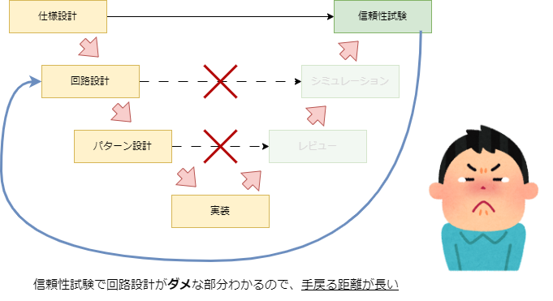

## 今日やったこと

Qiitaのイベントのキャリアの振り返りをしてみようと思います。

#### 仕事をする上で大切にしていること

私が仕事をする上で大切にしていることは、

**・長い手戻りは何も価値は生まない**
**・透明性**
**・説明責任**
の３つです。

#### なぜこの３つ？・・・

**手戻りの苦い過去**
私は、自動車業界に入る前、電源系のアナログ回路エンジニアを短い期間していました。
そこで、仕様折衝、回路設計、パターン設計、試作、信頼性試験の全工程を担当していました。

アナログは本当に素人で、右も左もわからない状態、授業で習う回路図が書けるくらい（抵抗書やコンデンサを置くくらいのレベル）でした。
開発を通して、得た学びは、「**長い手戻りは何も価値を生まない**」です。
ど素人が、回路設計し、パターンを設計しても、うまくいく訳はないですよね。（よくやらせてくれたなと思います、当時の職場に感謝です・・・）
回路図がだめだと、パターンもだめになり、当たり前ですが、性能も信頼性もない製品ができます。
当時すでに回路シミュレータはなどは巷にはありました。小さい会社ではなかなか使うことができないので、実機を使って評価を行うことが多かったと思います。
V字プロセスの、右上に該当するテスト（信頼性試験）で、だめだね（使い物にならないね）というのが分かります。
だめというのがわかって、戻る距離が非常に長いです。
いい設計ができないと、手戻りする距離、量が大きく、その分時間と費用を捨てることになってしまいます。
（試作品の部品の注文や、ポリテクセンターの予約も、自分でやっていたので、どんどん赤字になっていくのが分かり、ごめんなさいといつも思っていました。）

だから私は、長い手戻りがとても嫌いです。
早く失敗して、早く直して、お金をあまりかけずに良い製品開発をしたいと常々思っています。
今はソフトウェア開発に携わっているので、小さく作って、小さく失敗して、即修正するを実践しています。

**ミッションクリティカルに作る**
透明性と説明責任は、当時所属していた企業の社是になります。
私は、自動車部品サプライヤ（ブレーキ系）のソフトウェアエンジニアをしていました。
ブレーキと言えば、車に乗る人の命を守る安全部品の一つです。クリティカルセーフティであることが求められる製品です。
ブレーキ開発をする上で、製品開発の透明性が高く求められます。
透明性を担保するために、開発プロセスの順守、トレーサビリティ確立が当たり前の環境で育ちました。
「透明性」は、ユーザー（ドライバーや乗客）の安全を達成するために必要なことであり、また何かが起こったときにエンジニア自身を助けてくれます。
透明性を担保するためには、必然的に説明責任も必要になります。
透明性があることを、プロセスの順守、トレーサビリティの確保、テスト実行により、自分の開発したものが正しい状態・正しく動くことを証明する必要があります。

製品開発を進めながら、この社是は身に染みていきました。
今は、安全部品の開発に携わっていませんが、この三つのことを常に意識しています。

